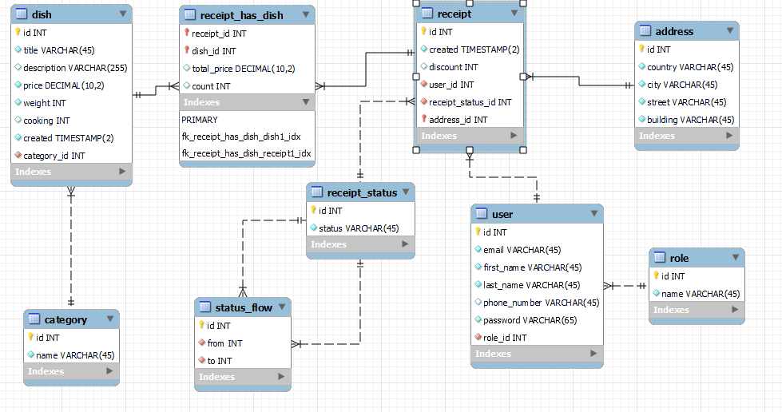

# restaurant-web-app
_Servlet-API, JDBC, MySql, Apache Tomcat, JSP..._

***PROJECT DESCRIPTION***

The task of the final project is to develop a web application
that supports the functionality according to the task variant.
There are roles:
```
Client,
Manager.
```
 The client (authorized user) places orders from the menu - the catalog of dishes
, and also has the opportunity to view the catalog taking into account the sorting:
```
- by the name of the dish;
- by cost;
- by category
- and filters the list of dishes by category.
```
 The customer,
within one order, can order several identical dishes.
The manager manages the orders: after receiving a new order,
sends it for cooking.
After cooking, the Manager passes the order for delivery.
After delivery and receiving payment,
the Manager changes the status of the order to "completed".

Database model:

